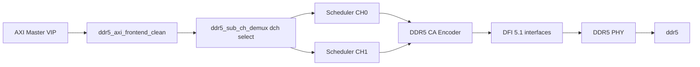
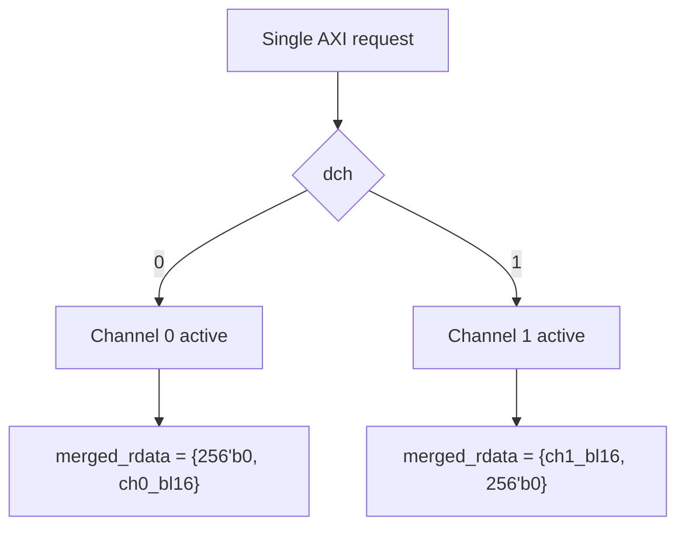

# DDR5 DRAM Module Integration Notes

## Implemented RTL

- `memory_module/ddr5.sv`
  - This is the supplied working DDR5 memory model, copied into the project-local
    `memory_module` folder and integrated behind the PHY.
  - Keeps the existing reset/init sequence, MR0 handling, simple write/read
    behavior, DQS capture, row/open-bank tracking, and `dch` channel behavior.
  - Includes `memory_module/ddr5_6400_parameters.sv` for DDR5-6400 timing.

- `memory_module/ddr5_mem_if.sv`
  - Project-local pin interface for `CK_t/CK_c`, `CS_n`, `RESET_n`, `CA`, `DQ`,
    `DQS_t/DQS_c`, `DMI`, and `dch`.

- `Controller_IP/ddr5_phy.sv`
  - Added full-burst PHY/DRAM sideband ports:
    - `dram_wr_valid*`, `dram_wr_data*`, `dram_wr_mask*`
    - `dram_rd_valid*`, `dram_rd_data*`
  - CA pins now serialize DFI command phases over `dram_clk`.

- `Controller_IP/ddr5_sub_ch_demux.sv`
  - Added `dch`.
  - `dch=0`: only channel 0 scheduler is driven; read data returns in `[255:0]`, upper `[511:256]` is zero.
  - `dch=1`: only channel 1 scheduler is driven; read data returns in `[511:256]`, lower `[255:0]` is zero.

- `Controller_IP/ddr5_ctrl_top.sv`
  - Added top-level `dch`.
  - Switched to `ddr5_axi_frontend_clean`.
  - Uses independent channel write-enable pipelines.
  - Read assembly now preserves the full 256-bit sub-channel BL16 payload.
  - Adds a post-MRW init guard before releasing AXI/scheduler traffic.

- `Controller_IP/ddr5_cmd_encoder.sv`
  - Encodes CA bus commands for the supplied model through DFI/PHY phases.
  - Holds two-cycle DDR5 command words across the PHY's CK sampling window.

- `Controller_IP/ddr5_bank_scheduler.sv`
  - Fixes CAS timing bookkeeping to use the pending transaction, not the live
    input pins.
  - Adds conservative write-to-read spacing for the supplied memory model's
    write-latency pipeline.

- `AXI_Master_VIP/axi_tb_top.sv`
  - Instantiates `ddr5` behind the PHY through `memory_module/ddr5_mem_if.sv`.
  - Defaults `dch=1'b0`.

## Speed Target

- DDR data rate: DDR5-6400, i.e. 6400 MT/s.
- DRAM CK frequency: 3200 MHz.
- Controller/DFI frequency: 800 MHz with 1:4 frequency ratio.
- Burst length: BL16.

## Data Path



## Channel Behavior



## Initialization

The DRAM model tracks reset, CKE, ZQ commands, and MRW programming before asserting `init_complete`. It rejects ACT/RD/WR before its internal initialization is complete.

Current project limitation: the controller/PHY initialization handshake and CA forwarding were partially behavioral before this work. CA serialization has been improved, but full JEDEC timing proof still requires a pin-accurate PHY or a DFI-monitor DRAM command input.

## Verification Run

Commands run:

```tcl
vlog -sv run.sv
vlog -sv ./memory_module/ddr5_mem_if.sv
vlog -sv ./memory_module/ddr5.sv
vlog -sv -suppress 7061 +define+UVM_NO_REGISTERED_CONVERTER ./AXI_Master_VIP/tb_run.sv +incdir+./AXI_Master_VIP +incdir+C:/questasim_10.4e/verilog_src/uvm-1.1c/src
vsim -c work.top -l result.log -sv_lib C:/questasim_10.4e/uvm-1.1c/win32/uvm_dpi -voptargs=+acc +UVM_TESTNAME=pcie_single_write_read_aligned_test -do "run -all; quit -f"
```

Compile result:

- RTL compile: 0 errors.
- UVM top compile: 0 errors.

Simulation result:

- Design loads and reaches AXI to controller to scheduler to PHY/DRAM activity.
- DDR5 reset/init passes the model gates: tINIT1/tINIT2/tINIT3/tINIT4/tINIT5.
- MRW commands program MR0/MR1/MR2/MR3/MR4/MR5/MR6; MR0 reports CL=40,
  CWL=38, BL=16 in the supplied model.
- ACT now reaches the DRAM and opens the target row before WR.
- WR/RD commands decode in the model without the earlier inactive-bank error.
- Remaining failure: write-data/DQS timing is not yet pin-accurate. Some write
  burst beats reach the model as zero/Z/X around the capture window, so the
  UVM scoreboard still fails on the back-to-back write/read test.

## Required Follow-Up Controller Fixes

- Complete a pin-accurate PHY write data path: DQS preamble, BL16 DQ validity
  across all 16 transfer edges, and DMI alignment.
- Complete a pin-accurate PHY read capture path instead of the current simple
  DQ-to-DFI bridge.
- Add a per-channel request FIFO or stronger demux/front-end hold-off so the
  accepted request stream cannot be confused with a previous pending CAS.

## Assumptions

- One rank.
- Two independent 32-bit sub-channels.
- BL16 fixed.
- DM is active-high byte mask.
- Storage depth is intentionally parameterized and smaller than a full DDR5 device; architectural address fields are preserved and folded into the memory index.
- MRR is supported as a simple mode-register readback pattern because the existing controller encoder does not currently issue MRR.
